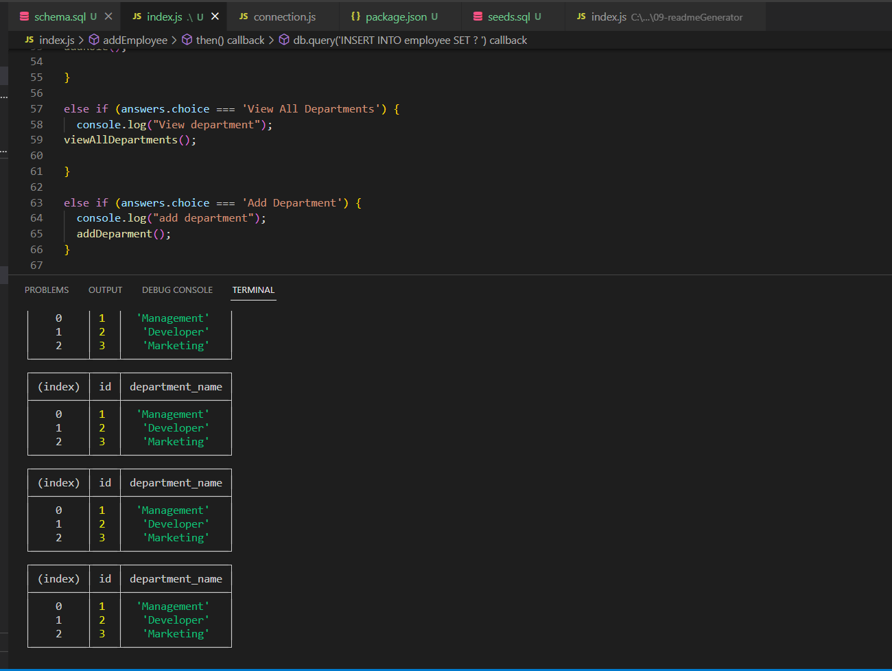

# CMS

# Table of Contents
- [Description](#description)
- [Installation](#installation)
- [Usage](#usage)
- [Credits](#credits)
- [Tests](#tests)
- [License](#license)
- [Questions](#questions)

## license 
    
  
This application is licensed by MIT

## Description

This app will allow you to check your database of employees, roles, and departments while also allowing you to make any changes you need to your databases

## Installation

Install the app from Github then run npm i in the terminal

## Usage

Open up the terminal and run the app. You will be given several choices to choose from. 

*Add Employee: Enter the first name, then the last name, then the role ID, then the manager ID
*Update Employee: Enter the employee ID of the desired employee then enter the role ID
*Add Role: Enter the name of the role then the department ID
*Add Department: Enter the name of the department

the view commands are self explanatory, they will display the desired category (employee, role, department).

(https://drive.google.com/file/d/1xWlSKMUwqhzQxRYnQoW_xfX3axnlGF0-/view?usp=sharing)

## Credits

Grant Creach

## Tests 

No, no special tests required

## Questions 

If you have any questions, reach out to me using the following:

Email: gcreach97@gmail.com
GitHub: Gcreach
